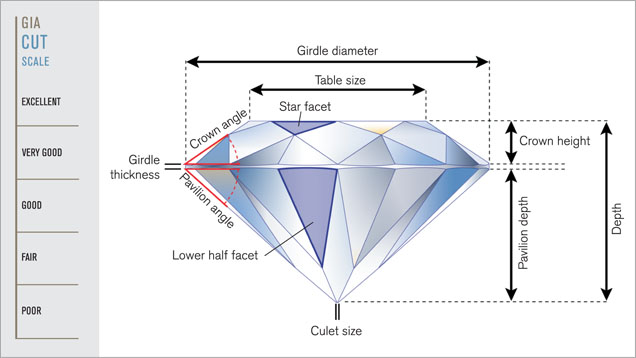
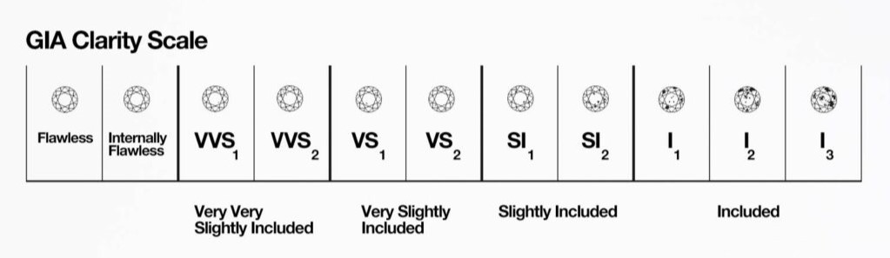
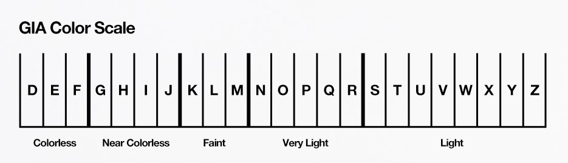
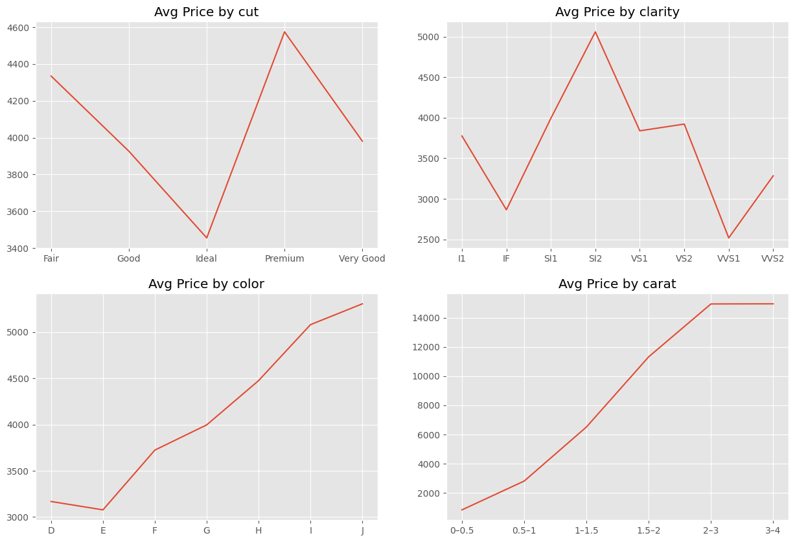
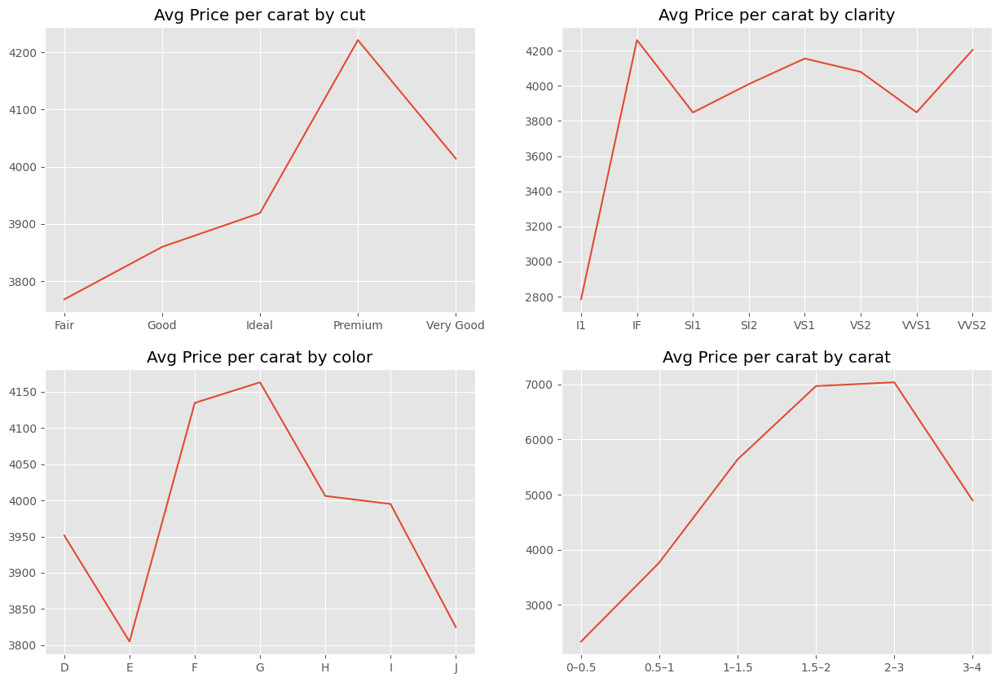

# Diamond Price Analysis & Predictive Modeling

The project uses the classic diamonds dataset, which contains information on 53,940 diamonds. Each entry includes price, carat weight, physical dimensions, and categorical quality attributes such as cut, color, and clarity. The dataset is widely used for exploratory data analysis and price modeling because it captures both linear and nonlinear relationships between features and value.   

## Overview
Dataset: [Diamonds Kaggle](https://www.kaggle.com/datasets/shivam2503/diamonds/data)  
Objective: Analyze diamonds by their cut, color, clarity, price, and other attributes  
Libraries: numpy, pandas, matplotlib, seaborn, scikit-learn  

## Features
   

**price** : price in US dollars ( $326 - $18,823 )   
**carat** : weight of the diamond ( 0.2 - 5.01 )  
**cut** : quality of the cut ( Fair , Good , Very Good , Premium , Ideal )  
**color** : diamond colour, from J ( worst ) to D ( best )  
**clarity** : a measurement of how clear the diamond is ( I1 (worst) ,SI2 ,SI1 ,VS2 ,VS1 ,VVS2 ,VVS1 ,IF (best))  
**x** : length in mm ( 0 - 10.74 )  
**y** : width in mm ( 0 - 58.9 )  
**z** : depth in mm ( 0 - 31.8 )  
**depth** : total depth percentage = z / mean( x, y ) = 2 * z / ( x + y ) --> ( 43 - 79 )  
**table** : width of top of diamond relative to widest point ( 43 - 95 )  

[GIA 4Cs](https://www.gia.edu/gia-about/4cs-cut)

### Preprocessing
-Removed invalid rows (x=0, y=0, z=0)  
-Encoded categorial features (cut, color, clarity) using label encoding  
-Detected and removed outliers using regression lines and boxplots   
-Added 'Price Per Carat' column and binned 'carat' for better insights.

## Model Evaluation
-**R2 (Coefficient of determination):** How much (%age) of the variation in y is described by x?   
-**RMSE (Root Mean Squared Error):** It is the square root of the average of squared difference b/w actual and predicted values in the dataset. It measures the standard deviation of residuals.  
-**MAE (Mean Absolute Error):** it represents the average of the absolute difference between the actual and predicted values in the dataset.  
The lower value of MAE, MSE, and RMSE implies higher accuracy of a regression model. However, a higher value of R square is considered desirable.

- **Linear Regression:**  
R2: 0.887    
RMSE: 1331  
MAE: 850
  
- **Decision Tree Regressor:**  
R2: 0.964  
RMSE: 745  
MAE: 365
  
- **Random Forest Regressor:**  
R2: 0.9816  
RMSE: 538  
MAE: 269  

Therefore, Random Forest explains **98.16%** of the variability in price. Mean price of all diamonds is $3928. RMSE = 538 means the model’s average error (dominated by big mistakes) is around $538. MAE = 269 means on average it is off by $269 per diamond.

## EDA and Findings
Some insights observed during EDA:  
- Carat is the strongest single predictor of price
  
- The **Average Price by cut/clarity/color/carat** plots show how raw prices change with each categorical feature independently. This set shows that raw averages are heavily dominated by carat differences.*
  
  
- What the **Price per Carat plots** reveal: These divide price by carat before averaging, which normalizes for stone size and lets you see the actual quality premium.  
  
- ***Inconsistencies in some places due to data compostion:**    
-the dataset makes lower-color stones appear more expensive per carat. This a data bias, not an error.  
-Many SI1/SI2 stones are in bigger carat sizes -> higher price per carat. Many VVS1/VVS2 stones are in smaller carats -> lower price per carat. Again, carat influences ppc way more than clarity does, so clarity looks inconsistent.
-D–G generally command higher per-carat prices than H–J. The slight bumps and dips are again dataset composition, but the signal is clear; Better color -> higher value.  
  
  

